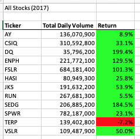
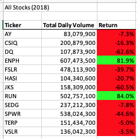
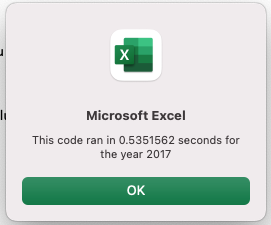
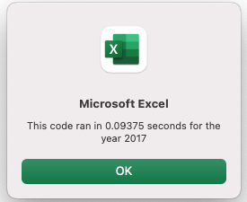
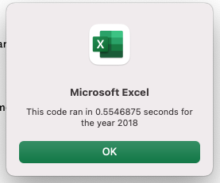
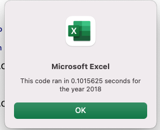

# Analysis of all Green Stocks

## Overview of Project
During this analysis we will be helping Steve refactor the previous code we had prepared for him. This new code will loop through all the data in a more efficient manner so that Steve can do a more in depth analysis of all the dataset. We will provide a comparison of the time the original code takes to run vs the new refractored code. Also, comment on the advantages and disadvantages of refractorng code.

## Results

### Stock Performance Comparison (2017 vs 2018)

The initial purpose of this project was to help Steve analyse the dataset that includes all stocks on green companies so that his parents can take an informed decison on where it's best to invest. Taking a look at the resutls from 12 differet companies through the years of 2017 and 2018 the best option for investments would be to divide their investments between ENPH and RUN. Both this companies show growth during both years and in an important amount. 

                   
 

Steve's parents can now divide their investments between more than one company and not have all their eggs in one basket. Also, Steve can keep using the code in upcomming years to keep an eye on how every company is doing and make an informed decision every year.

### Original vs Refactored Script

Another purpose of this project was to help Steve create a better versioin of the code that will do the analysis in a more efficient way. With the original script the code goes over all the data 12 times, and brings the information out for one company at a time until it finishes. On the other hand, the refractored code goes into the data only once and uses the stock TickerIndex to travel through the data.

## Summary

The original script runs the data for 2017 in a little over half a second vs 0.09 seconds for the refractored script. In a similar manner 2018 data for the origial script runs in 0.55 seconds and the refactored only takes 0.1 seconds. 

#### 2017 Original vs 2017 Refractored
                   

#### 2018 Original vs 2018 Refractored
       

Maybe with a dataset of this size the time difference is not very significant. But if Steve's parents ever want to broaden their options and see a report of more companies the refactored code only takes 20% of the time the original code takes to run. 

